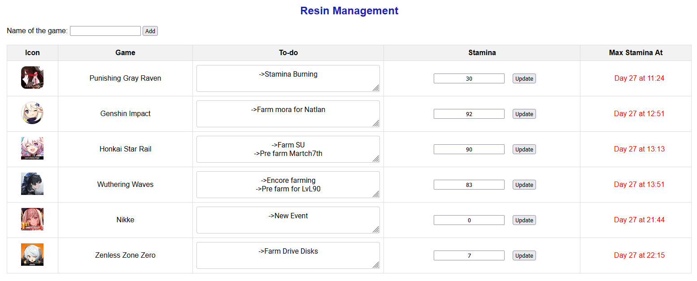

# Resin Management



## Descrição

O Resin Management é uma aplicação desenvolvida para ajudar jogadores de gacha games a gerenciar a resina (ou stamina) de seus jogos favoritos. Com esta aplicação, você pode informar a resina atual, calcular quando ela estará cheia novamente e registrar as tarefas pendentes para cada jogo, como farmar ouro, experiência, bosses, e pré-farmar para níveis específicos.

## Tecnologias Utilizadas

- HTML
- CSS
- JavaScript
- Dexie.js (IndexedDB Wrapper)

## Funcionalidades

- **Gerenciamento de Resina:** Informe a resina atual e calcule quando ela estará cheia.
- **Registro de Tarefas Pendentes:** Mantenha um registro das tarefas que você pretende fazer em cada jogo.
- **Calculadora de Tempo para Eventos:** Calcule o tempo restante para o término de eventos nos jogos.

# To-do List
- [X] Order the games by the date where the stamina is closest to full
- [X] Use IndexedDB instead of localStorage
- [X] Create a function to show pending tasks to-do in the game
- [ ] Add an option to mark/unmark gacha dailies as done

```
npm install -g typescript // install it globally
node -v // typescript runs under node

tsc index.ts // gera arquivo js
node index.js // runs the js file
tsc index.ts --target "ESNEXT" // arquivo js com a versão mais recente do EcmaScript

tsc --init // gera arquivo tsconfig.json
tsc --watch // automatically generetes de js file
```
